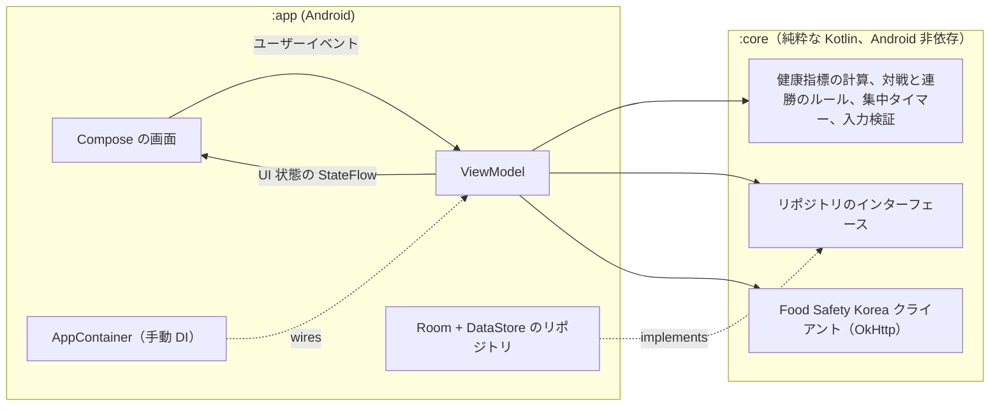

<div align="center">

🇺🇸 [English](README.md) | 🇨🇳 [简体中文](README.zh-CN.md) | 🇭🇰 [繁體中文](README.zh-HK.md) | 🇯🇵 **日本語** | 🇰🇷 [한국어](README.ko.md)

# Beating Yesterday

**日々の自己改善を記録するトラッカーです。毎日が、昨日の自分との試合になります。**

[](https://github.com/jumincho/beating-yesterday/actions/workflows/ci.yml)
[](LICENSE)
-3DDC84?logo=android&logoColor=white)


</div>

## 概要

食べたもの、集中した時間、終えたタスクを記録します。ホーム（Home）画面では、今日と昨日が**食事**（Diet）、**集中**（Focus）、**タスク**（Tasks）の3ラウンドで対戦し、昨日の自分に勝っているかどうか、連勝が何日続いているか、そしてこの1週間の成績を表示します。

| ホーム | 食事 | 集中 |
| :---: | :---: | :---: |
|  |  |  |
| **タスク** | **プロフィール**（Profile） | **ダークテーマのホーム** |
|  |  |  |

これらのスクリーンショットは、サンプルデータを入れたアプリの実際の Compose UI です。スマートフォンで撮影したものではなく、GitHub Actions 上で [Robolectric のスクリーンショットテスト](app/src/test/kotlin/com/jumincho/beatingyesterday/ui/ScreenshotTest.kt)によってレンダリングしています。

## 機能

- **オンボーディングとプロフィール**：名前、性別、生まれた年、身長、体重、活動レベルを入力します。入力内容は検証され、わかりやすいエラーメッセージが表示されます。プロフィール画面には、BMI、基礎代謝量、1日のエネルギー消費量と、そこから求めた目標カロリーが表示されます。
- **食事**：食事を朝食・昼食・夕食・間食に分けて記録します。記録は編集でき、削除は元に戻す（Undo）ことも可能で、過去の日の記録も閲覧できます。プログレスバーで、その日の合計を目標と比較します。
- **カロリー検索（オプション）**：Food Safety Korea の栄養成分データベース（OpenAPI サービス `I2790`）を検索し、検索結果から食事の内容を入力できます。API キーがない場合はアプリがその旨を表示し、手入力は引き続き使えます。
- **集中タイマー**：カウントダウン（25分または50分、あるいは最長3時間の任意の長さ）またはストップウォッチで計測でき、一時停止（Pause）、再開（Resume）、停止（Stop）に対応しています。表示には Compose の `Canvas` に描画したプログレスリングを使います。時間はタイムスタンプから計算し、実行中のセッションは保存されるため、アプリを再起動してもタイマーは中断したところから続きます。1分以上のセッションが記録されます。アプリを閉じている間に終了したカウントダウンは、次にアプリを起動したときに記録されます。
- **タスク**：今日のタスクを追加、完了、削除（元に戻すことも可能）できます。未完了のタスクは、完了するか削除するまで翌日に持ち越されます。
- **ホームのスコアボード**：今日と昨日をラウンドごとに比べ、判定、連勝記録、直近7日間の履歴を表示します。日付はローカル時刻の午前0時に自動で切り替わります。
- **Material 3 UI**：Android 12 以降でのダイナミックカラー、ライトテーマとダークテーマ、エッジツーエッジのレイアウト、英語と韓国語の翻訳、スクリーンリーダー向けのラベルと見出しに対応しています。

すべてのデータは端末内に保存されます。ネットワークを使うのは、オプションの食品検索だけです。

## スコアの仕組み

### 健康に関する数値

| 項目 | 計算式 |
| --- | --- |
| BMI | weight (kg) ÷ height (m)²、小数点以下1桁に四捨五入 |
| 基礎代謝量（Mifflin–St Jeor） | 10 × weight + 6.25 × height − 5 × age **+ 5**（男性）または **− 161**（女性） |
| 1日のエネルギー消費量（TDEE） | BMR × activity factor（活動係数）：1.2 · 1.375 · 1.55 · 1.725 · 1.9（座りがち → 非常に活発） |
| 1日の目標カロリー | TDEE + adjustment for the BMI category（BMI 区分に応じた調整値）。ただし 1,500 kcal（男性）または 1,200 kcal（女性）を下回らない |

年齢は、現在の年から生まれた年を引いた値で近似しています。BMI の区分には、韓国肥満学会（Korean Society for the Study of Obesity）も採用しているアジア太平洋地域のカットオフ値を用います。

| BMI (kg/m²) | 区分 | 目標の調整値 |
| --- | --- | ---: |
| < 18.5 | 低体重 | +300 kcal |
| 18.5 – < 23 | 普通体重 | ±0 kcal |
| 23 – < 25 | 過体重 | −300 kcal |
| ≥ 25 | 肥満 | −500 kcal |

調整値とカロリーの下限は、このアプリが独自に定めた控えめな値であり、臨床上の推奨ではありません。

> [!NOTE]
> これらは動機づけのための一般集団向けの推定値であり、医学的な助言ではありません。食生活を変える前に、医療の専門家に相談してください。

出典：

- Mifflin MD, St Jeor ST, Hill LA, Scott BJ, Daugherty SA, Koh YO. *A new predictive equation for
  resting energy expenditure in healthy individuals.* Am J Clin Nutr. 1990;51(2):241–247.
- WHO Regional Office for the Western Pacific, IASO and IOTF. *The Asia-Pacific perspective:
  redefining obesity and its treatment.* 2000.
- Korean Society for the Study of Obesity. *Diagnosis of Obesity: 2022 Update of Clinical Practice
  Guidelines for Obesity.* J Obes Metab Syndr. 2023;32(2):121–129.

### 毎日の対戦

| ラウンド | 今日が勝つ条件 | データなしになる条件 |
| --- | --- | --- |
| 食事 | 摂取カロリーが昨日よりも1日の目標カロリーに近い | どちらかの日に食事の記録がない |
| 集中 | 分単位で数えた集中時間が長い | —（集中しなかった日は0分として数える） |
| タスク | その日に完了したタスクが多い | —（タスクがない場合は0件として数える） |

- 値が同じ場合、そのラウンドは引き分けです。どちらの日も、現在の目標カロリーを基準に判定します。
- **判定**：今日が勝ったラウンドが負けたラウンドより多ければ**勝ち**、少なければ**負け**、それ以外は**引き分け**です。
- **連勝**：前日に勝った日が連続している日数です。今日は勝っている時点ですぐに連勝に加わりますが、午前0時になるまでは連勝を途切れさせることはありません。
- 集中セッションは開始した日に、タスクは完了した日に計上されます。

## アーキテクチャ

コードは、純粋な Kotlin のドメインモジュールと、薄い Android アプリモジュールに分かれています。



- **`:core`** には、通常の JVM でテストできるものがすべて含まれます。ドメインモデル、健康指標の計算機能、プロフィールと食事の入力検証、対戦と連勝のエンジン、集中タイマーのステートマシンとコントローラー、リポジトリのインターフェース、そして `I2790` API クライアントです。AndroidX には依存せず、アプリのテストでも再利用するテストフィクスチャ（フェイクと制御可能な時計）を提供します。
- **`:app`** には、Compose UI、画面ごとに1つずつ用意して不変の UI 状態を `StateFlow` として公開する ViewModel、Room と DataStore によるリポジトリの実装、型安全な Navigation Compose のルート、そして `Application` で組み立てる小さな `AppContainer` が含まれます。
- 時刻は注入された `java.time.Clock` から取得します。これにより、日付の境界をテスト可能に保ち、端末のローカル時刻に合わせられます。

## 技術スタック

| 分野 | 採用技術 |
| --- | --- |
| 言語 | Kotlin 2.2（JVM ターゲット 17）、コルーチンと Flow |
| UI | Jetpack Compose（BOM 2026.06.01）、Material 3、型安全なルートを使った Navigation Compose |
| 状態管理 | AndroidX ViewModel と Lifecycle、`StateFlow` |
| ストレージ | 食事・セッション・タスクには Room 2.8（KSP）、プロフィールと実行中のタイマーには DataStore Preferences |
| ネットワーク | OkHttp 5 と kotlinx.serialization |
| ビルド | Gradle 8.14（Kotlin DSL、バージョンカタログ）、Android Gradle Plugin 8.13、compile/target SDK 36、min SDK 26 |
| テスト | JUnit 6、kotlinx-coroutines-test、OkHttp MockWebServer。スクリーンショットテストには Robolectric と Roborazzi |
| CI | GitHub Actions：プッシュのたびに単体テスト、Android Lint、デバッグ APK のビルドを実行。スクリーンショットは手動のワークフローで撮り直し |

正確なバージョンは [`gradle/libs.versions.toml`](gradle/libs.versions.toml) にあります。

## プロジェクト構成

```text
beating-yesterday/
├── app/                                  Android アプリケーション
│   ├── schemas/                          エクスポートした Room スキーマ（将来のマイグレーション用）
│   └── src/
│       ├── main/kotlin/com/jumincho/beatingyesterday/
│       │   ├── data/                     Room データベース、DataStore、リポジトリの実装
│       │   ├── di/                       AppContainer（手動の依存性注入）
│       │   └── ui/                       画面と ViewModel
│       │       ├── home/  diet/  focus/  tasks/  profile/
│       │       └── components/  format/  navigation/  theme/
│       ├── main/res/                     文字列（英語、韓国語）、アイコン、ランチャーアイコン
│       └── test/                         ViewModel、永続化マッピング、スクリーンショットのテスト
├── core/                                 純粋な Kotlin のドメインモジュール
│   └── src/
│       ├── main/kotlin/com/jumincho/beatingyesterday/core/
│       │   ├── contest/                  ラウンド、判定、連勝、直近の日ごとの結果
│       │   ├── data/                     リポジトリのインターフェース
│       │   ├── food/                     Food Safety Korea I2790 クライアント
│       │   ├── health/                   BMI、BMR、TDEE、目標カロリー
│       │   ├── meal/  profile/  validation/
│       │   ├── model/                    ドメインモデル
│       │   ├── time/                     端末の時計と日付の切り替え
│       │   └── timer/                    集中タイマーのステートマシンとコントローラー
│       ├── test/                         単体テスト
│       └── testFixtures/                 アプリのテストと共有するフェイク
├── docs/
│   ├── presentation.pptx                 プロジェクトのスライド
│   └── screenshots/                      README 用スクリーンショット（CI で記録）
├── gradle/libs.versions.toml             バージョンカタログ
└── .github/workflows/                    ci.yml（プッシュごと）、screenshots.yml（手動）
```

## はじめに

### 必要な環境

- JDK 17 以降
- Android SDK Platform 36
- 実機やエミュレーターでアプリを実行する場合は、Android Gradle Plugin 8.13 に対応した最近のバージョンの Android Studio

### オプション：食品検索用の API キー

カロリー検索には、Food Safety Korea の Open API（`I2790` サービス）の個人用キーが必要です。キーは [Food Safety Korea のデータポータル](https://www.foodsafetykorea.go.kr/api/main.do)で発行されます。プロジェクトルートの `local.properties` に記述してください（このファイルは git の管理対象外です）。

```properties
FOOD_API_KEY=your-key
```

または、`FOOD_API_KEY` を環境変数として export してください。キーがなくてもアプリはビルド・実行でき、検索セクションには検索が無効になっている旨が表示されます。キーは APK に組み込まれるため、クライアントアプリ向けのキーを使ってください。

### ビルドとテスト

```bash
./gradlew assembleDebug                          # app/build/outputs/apk/debug/app-debug.apk
./gradlew :core:test :app:testDebugUnitTest      # 単体テスト
./gradlew :app:lintDebug                         # Android Lint
```

CI はプッシュのたびに同じタスクを実行し、デバッグ APK とテスト・Lint のレポートをワークフローのアーティファクトとしてアップロードします。

単体テストには [`ScreenshotTest`](app/src/test/kotlin/com/jumincho/beatingyesterday/ui/ScreenshotTest.kt) が含まれます。このテストは Robolectric で主要な画面をレンダリングし、主な内容を確認します。UI を変更した後に `docs/screenshots` の画像を撮り直すには、Actions タブから **Screenshots** ワークフローを実行する（新しい画像は、ワークフローを実行したブランチにコミットされます）か、ローカルで記録します。

```bash
./gradlew :app:testDebugUnitTest --tests com.jumincho.beatingyesterday.ui.ScreenshotTest --rerun -PrecordScreenshots
```

## ライセンス

[MIT](LICENSE) © 2021 jumincho
