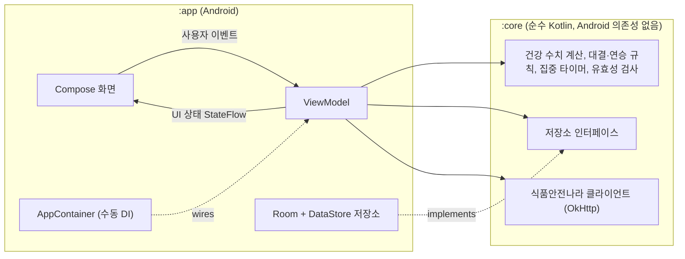

<div align="center">

🇺🇸 [English](README.md) | 🇨🇳 [简体中文](README.zh-CN.md) | 🇭🇰 [繁體中文](README.zh-HK.md) | 🇯🇵 [日本語](README.ja.md) | 🇰🇷 **한국어**

# Beating Yesterday

**매일 쓰는 자기계발 트래커로, 하루하루가 어제의 나와 겨루는 승부가 됩니다.**

[](https://github.com/jumincho/beating-yesterday/actions/workflows/ci.yml)
[](LICENSE)
-3DDC84?logo=android&logoColor=white)


</div>

## 개요

먹은 음식, 집중한 시간, 끝낸 할 일을 기록합니다. 홈 화면은 오늘과 어제를 **식단**, **집중**, **할 일**
세 라운드로 겨루게 하고, 지금 어제의 나를 이기고 있는지, 연승이 며칠째 이어지고 있는지, 지난 한 주가
어땠는지 알려 줍니다.

| 홈 | 식단 | 집중 |
| :---: | :---: | :---: |
|  |  |  |
| **할 일** | **프로필** | **다크 테마의 홈** |
|  |  |  |

이 스크린샷은 샘플 데이터로 채운 앱의 실제 Compose UI를 보여 줍니다. 휴대폰에서 캡처한 것이 아니라 GitHub Actions에서
[Robolectric 스크린샷 테스트](app/src/test/kotlin/com/jumincho/beatingyesterday/ui/ScreenshotTest.kt)로
렌더링한 것입니다.

## 기능

- **온보딩과 프로필** — 이름, 성별, 출생 연도, 키, 몸무게, 활동량을 입력받으며, 입력값을 검증하고
  명확한 오류 메시지를 보여 줍니다. 프로필 화면에는 BMI, 기초대사량, 하루 에너지 소비량과 이를 바탕으로
  정한 목표 칼로리가 표시됩니다.
- **식단** — 식사를 아침, 점심, 저녁, 간식으로 나누어 기록합니다. 기록을 수정할 수 있고, 삭제한 기록은
  실행 취소로 되돌릴 수 있으며, 이전 날짜의 기록도 살펴볼 수 있습니다. 진행률 막대가 그날의 합계를 목표와
  비교해 보여 줍니다.
- **칼로리 검색(선택 사항)** — 식품안전나라 식품영양성분 데이터베이스(OpenAPI 서비스 `I2790`)를 검색하고,
  검색 결과로 식사 정보를 채울 수 있습니다. API 키가 없으면 앱이 그 사실을 알려 주며, 직접 입력은 계속
  사용할 수 있습니다.
- **집중 타이머** — 카운트다운 타이머(25분이나 50분, 또는 최대 3시간까지 직접 설정한 시간)나 스톱워치를
  쓸 수 있고, 일시정지, 계속, 종료를 지원하며, Compose `Canvas`에 그린 진행 링으로 표시됩니다. 시간은
  타임스탬프로 계산하고 진행 중인 세션을 저장하므로, 앱을 다시 시작해도 타이머가 멈춘 곳에서 이어집니다.
  1분 이상인 세션은 기록되며, 앱이 닫혀 있는 동안 끝난 카운트다운은 다음에 앱을 시작할 때 기록됩니다.
- **할 일** — 오늘의 할 일을 추가하고, 완료하고, 삭제(실행 취소 가능)할 수 있습니다. 끝내지 못한 할 일은
  완료하거나 삭제할 때까지 다음 날로 넘어갑니다.
- **홈 점수판** — 오늘과 어제를 라운드별로 비교하고, 판정, 연승 기록, 최근 7일 기록을 보여 줍니다. 날짜는
  현지 시각 자정에 자동으로 바뀝니다.
- **Material 3 UI** — Android 12 이상의 동적 색상, 라이트·다크 테마, 엣지 투 엣지 레이아웃, 영어·한국어
  번역, 스크린 리더용 레이블과 제목을 지원합니다.

모든 데이터는 기기에만 저장됩니다. 네트워크 요청은 선택 사항인 음식 검색뿐입니다.

## 점수 계산 방식

### 건강 수치

| 항목 | 공식 |
| --- | --- |
| BMI | weight (kg) ÷ height (m)², 소수점 첫째 자리까지 반올림 |
| 기초대사량(Mifflin–St Jeor) | 10 × weight + 6.25 × height − 5 × age **+ 5**(남성) 또는 **− 161**(여성) |
| 하루 에너지 소비량(TDEE) | BMR × activity factor(활동 계수): 1.2 · 1.375 · 1.55 · 1.725 · 1.9(거의 활동하지 않음 → 매우 활발한 활동) |
| 하루 목표 칼로리 | TDEE + adjustment for the BMI category(BMI 분류별 조정값), 단 1,500 kcal(남성) 또는 1,200 kcal(여성) 밑으로는 내려가지 않음 |

나이는 현재 연도에서 출생 연도를 뺀 값으로 근사합니다. BMI 분류에는 대한비만학회도 사용하는
아시아·태평양 기준을 적용합니다.

| BMI (kg/m²) | 분류 | 목표 조정값 |
| --- | --- | ---: |
| < 18.5 | 저체중 | +300 kcal |
| 18.5 – < 23 | 정상 | ±0 kcal |
| 23 – < 25 | 과체중 | −300 kcal |
| ≥ 25 | 비만 | −500 kcal |

조정값과 칼로리 하한은 이 앱이 자체적으로 정한 보수적인 값이며, 임상 권고가 아닙니다.

> [!NOTE]
> 이 수치는 동기 부여를 위한 일반 인구 기준의 추정치이며, 의학적 조언이 아닙니다. 식단을 바꾸기 전에
> 의료 전문가와 상담하시기 바랍니다.

출처:

- Mifflin MD, St Jeor ST, Hill LA, Scott BJ, Daugherty SA, Koh YO. *A new predictive equation for
  resting energy expenditure in healthy individuals.* Am J Clin Nutr. 1990;51(2):241–247.
- WHO Regional Office for the Western Pacific, IASO and IOTF. *The Asia-Pacific perspective:
  redefining obesity and its treatment.* 2000.
- Korean Society for the Study of Obesity. *Diagnosis of Obesity: 2022 Update of Clinical Practice
  Guidelines for Obesity.* J Obes Metab Syndr. 2023;32(2):121–129.

### 매일의 대결

| 라운드 | 오늘이 이기는 경우 | ‘기록 없음’이 되는 경우 |
| --- | --- | --- |
| 식단 | 섭취 칼로리가 어제보다 하루 목표 칼로리에 더 가까울 때 | 두 날 중 하루라도 식사 기록이 없을 때 |
| 집중 | 분 단위로 센 집중 시간이 더 길 때 | — (집중하지 않은 날은 0분으로 계산) |
| 할 일 | 그날 완료한 할 일이 더 많을 때 | — (완료한 할 일이 없으면 0개로 계산) |

- 값이 같으면 그 라운드는 무승부입니다. 두 날 모두 현재의 목표 칼로리를 기준으로 판정합니다.
- **판정:** 오늘 이긴 라운드가 진 라운드보다 많으면 **승리**, 적으면 **패배**, 그 밖에는 **무승부**입니다.
- **연승:** 전날을 이긴 날이 연속으로 이어진 일수입니다. 오늘은 이기고 있으면 그 즉시 연승에 더해지지만,
  자정이 되기 전에는 연승을 끊을 수 없습니다.
- 집중 세션은 시작한 날에, 할 일은 완료한 날에 집계됩니다.

## 아키텍처

코드는 순수 Kotlin 도메인 모듈과 얇은 Android 앱 모듈로 나뉩니다.



- **`:core`** 모듈에는 일반 JVM에서 테스트할 수 있는 모든 것이 들어 있습니다. 도메인 모델, 건강 수치
  계산기, 프로필·식사 유효성 검사, 대결·연승 엔진, 집중 타이머의 상태 머신과 컨트롤러, 저장소 인터페이스,
  `I2790` API 클라이언트가 여기에 속합니다. AndroidX 의존성이 없으며, 앱 테스트에서도 재사용하는 테스트
  픽스처(페이크와 제어 가능한 시계)를 함께 제공합니다.
- **`:app`** 모듈에는 Compose UI, 화면마다 하나씩 두어 불변 UI 상태를 `StateFlow`로 노출하는
  ViewModel, Room과 DataStore로 구현한 저장소, 타입 안전한 Navigation Compose 경로, 그리고
  `Application`에서 만드는 작은 `AppContainer`가 들어 있습니다.
- 시간은 주입된 `java.time.Clock`에서 가져오므로, 날짜 경계를 테스트할 수 있고 현지 시각 기준으로 유지할
  수 있습니다.

## 기술 스택

| 영역 | 사용 기술 |
| --- | --- |
| 언어 | Kotlin 2.2(JVM 타깃 17), 코루틴과 Flow |
| UI | Jetpack Compose(BOM 2026.06.01), Material 3, 타입 안전한 경로를 지원하는 Navigation Compose |
| 상태 관리 | AndroidX ViewModel과 Lifecycle, `StateFlow` |
| 데이터 저장 | 식사·세션·할 일은 Room 2.8(KSP), 프로필과 실행 중인 타이머는 DataStore Preferences |
| 네트워크 | OkHttp 5와 kotlinx.serialization |
| 빌드 | Gradle 8.14(Kotlin DSL, 버전 카탈로그), Android Gradle Plugin 8.13, compile/target SDK 36, min SDK 26 |
| 테스트 | JUnit 6, kotlinx-coroutines-test, OkHttp MockWebServer; 스크린샷 테스트에는 Robolectric과 Roborazzi |
| CI | GitHub Actions: 푸시할 때마다 단위 테스트, Android Lint, 디버그 APK 빌드를 실행하고, 수동 워크플로로 스크린샷을 다시 기록 |

정확한 버전은 [`gradle/libs.versions.toml`](gradle/libs.versions.toml)에서 확인할 수 있습니다.

## 프로젝트 구조

```text
beating-yesterday/
├── app/                                  Android 애플리케이션
│   ├── schemas/                          내보낸 Room 스키마(향후 마이그레이션용)
│   └── src/
│       ├── main/kotlin/com/jumincho/beatingyesterday/
│       │   ├── data/                     Room 데이터베이스, DataStore, 저장소 구현
│       │   ├── di/                       AppContainer(수동 의존성 주입)
│       │   └── ui/                       화면과 ViewModel
│       │       ├── home/  diet/  focus/  tasks/  profile/
│       │       └── components/  format/  navigation/  theme/
│       ├── main/res/                     문자열(영어, 한국어), 아이콘, 런처 아이콘
│       └── test/                         ViewModel, 영속성 매핑, 스크린샷 테스트
├── core/                                 순수 Kotlin 도메인 모듈
│   └── src/
│       ├── main/kotlin/com/jumincho/beatingyesterday/core/
│       │   ├── contest/                  라운드, 판정, 연승, 최근 날짜별 결과
│       │   ├── data/                     저장소 인터페이스
│       │   ├── food/                     식품안전나라 I2790 클라이언트
│       │   ├── health/                   BMI, BMR, TDEE, 목표 칼로리
│       │   ├── meal/  profile/  validation/
│       │   ├── model/                    도메인 모델
│       │   ├── time/                     기기 시계와 날짜 전환
│       │   └── timer/                    집중 타이머 상태 머신과 컨트롤러
│       ├── test/                         단위 테스트
│       └── testFixtures/                 앱 테스트와 공유하는 페이크
├── docs/
│   ├── presentation.pptx                 프로젝트 발표 자료
│   └── screenshots/                      README 스크린샷(CI에서 기록)
├── gradle/libs.versions.toml             버전 카탈로그
└── .github/workflows/                    ci.yml(푸시마다), screenshots.yml(수동)
```

## 시작하기

### 요구 사항

- JDK 17 이상
- Android SDK Platform 36
- 기기나 에뮬레이터에서 앱을 실행하려면 Android Gradle Plugin 8.13을 지원하는 최근 버전의 Android Studio

### 선택 사항: 음식 검색 API 키

칼로리 검색에는 식품안전나라 Open API(`I2790` 서비스)의 개인 인증키가 필요하며, 이 키는
[식품안전나라 데이터 포털](https://www.foodsafetykorea.go.kr/api/main.do)에서 발급받습니다. 발급받은 키는
프로젝트 루트의 `local.properties`에 넣습니다(이 파일은 git에서 무시됩니다).

```properties
FOOD_API_KEY=your-key
```

또는 `FOOD_API_KEY`를 환경 변수로 설정(export)해도 됩니다. 키가 없어도 앱은 빌드되고 실행되며, 검색
영역에 검색 기능이 꺼져 있다는 안내가 표시됩니다. 키는 APK 안에 컴파일되어 들어가므로, 클라이언트 앱에서
쓰도록 발급된 키를 사용하십시오.

### 빌드와 테스트

```bash
./gradlew assembleDebug                          # app/build/outputs/apk/debug/app-debug.apk
./gradlew :core:test :app:testDebugUnitTest      # 단위 테스트
./gradlew :app:lintDebug                         # Android Lint
```

CI는 푸시할 때마다 같은 태스크를 실행하고, 디버그 APK와 테스트·Lint 보고서를 워크플로 아티팩트로
업로드합니다.

단위 테스트에는 [`ScreenshotTest`](app/src/test/kotlin/com/jumincho/beatingyesterday/ui/ScreenshotTest.kt)도
포함되어 있습니다. 이 테스트는 Robolectric으로 주요 화면을 렌더링하고 핵심 내용을 확인합니다. UI를 바꾼
뒤 `docs/screenshots`의 이미지를 다시 기록하려면 Actions 탭에서 **Screenshots** 워크플로를
실행하거나(워크플로가 실행된 브랜치에 새 이미지를 커밋합니다), 로컬에서 기록합니다.

```bash
./gradlew :app:testDebugUnitTest --tests com.jumincho.beatingyesterday.ui.ScreenshotTest --rerun -PrecordScreenshots
```

## 라이선스

[MIT](LICENSE) © 2021 jumincho
