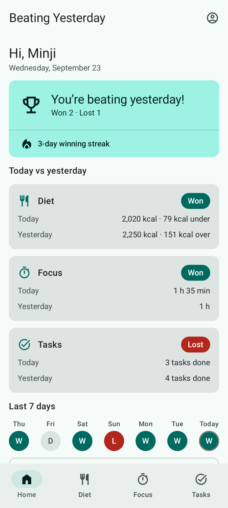
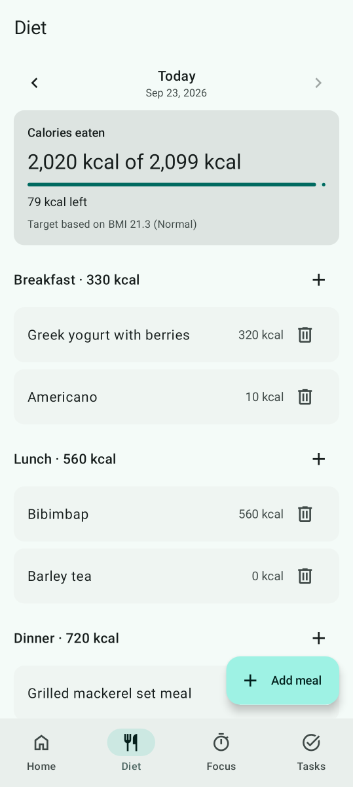
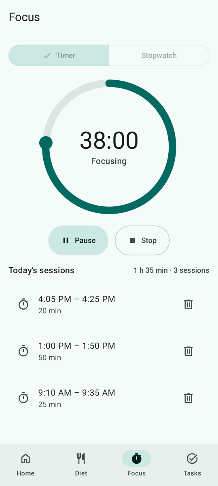
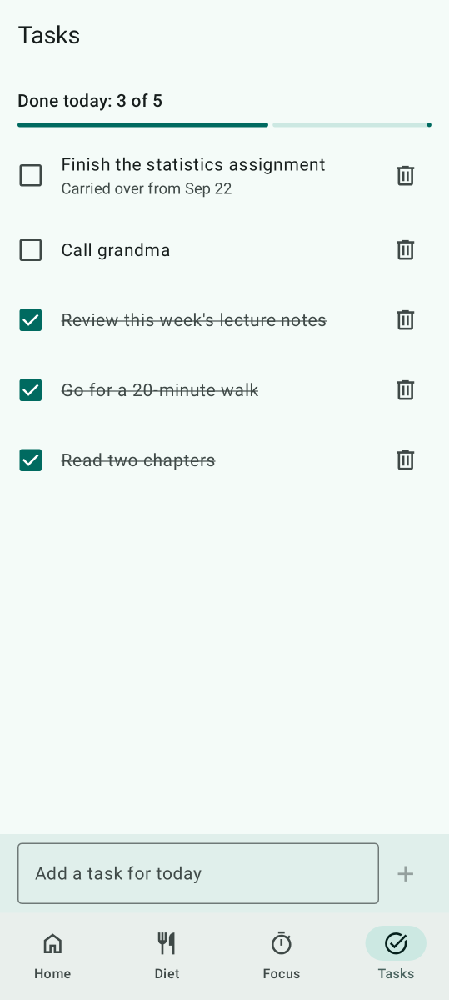
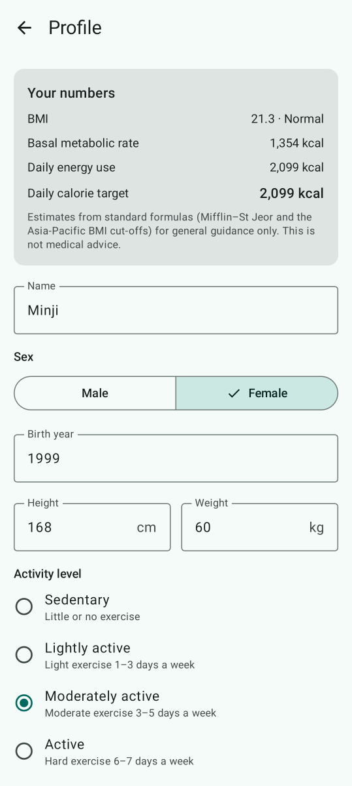
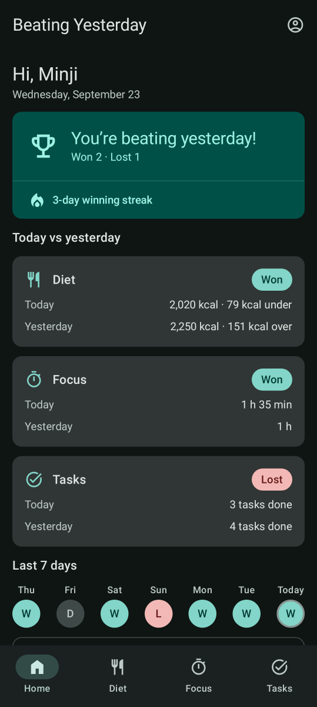
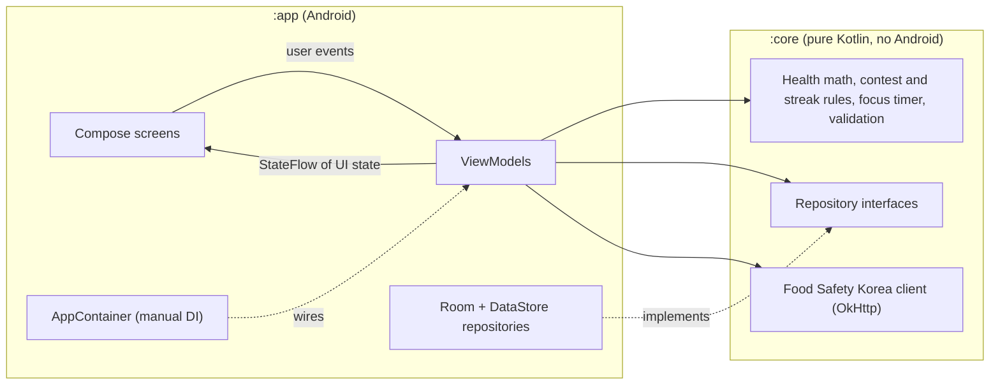

<div align="center">

# Beating Yesterday

**A daily self-improvement tracker where every day is a match against yesterday's you.**

[](https://github.com/jumincho/beating-yesterday/actions/workflows/ci.yml)
[](LICENSE)
-3DDC84?logo=android&logoColor=white)


</div>

## Overview

Log what you eat, the time you spend focused and the tasks you finish. The Home screen plays
today against yesterday in three rounds — **Diet**, **Focus** and **Tasks** — and tells you
whether you are beating yesterday's you, how long your winning streak is, and how the last week
went.

| Home | Diet | Focus |
| :---: | :---: | :---: |
|  |  |  |
| **Tasks** | **Profile** | **Home in the dark theme** |
|  |  |  |

These screenshots show the app's real Compose UI filled with sample data. They are rendered by
[Robolectric screenshot tests](app/src/test/kotlin/com/jumincho/beatingyesterday/ui/ScreenshotTest.kt)
on GitHub Actions, not captured on a phone.

## Features

- **Onboarding and profile** — name, sex, birth year, height, weight and activity level, with
  validated input and clear error messages. The profile screen shows your BMI, basal metabolic
  rate, daily energy use and the resulting calorie target.
- **Diet** — log meals as breakfast, lunch, dinner or snack; edit them, delete them with undo, and
  browse earlier days. A progress bar compares the day's total with your target.
- **Optional calorie lookup** — search the Food Safety Korea nutrition database (OpenAPI service
  `I2790`) and fill in a meal from a result. Without an API key the app says so and manual entry
  keeps working.
- **Focus timer** — a countdown (25 or 50 minutes, or a custom length up to 3 hours) or a
  stopwatch, with pause, resume and stop, drawn as a progress ring on a Compose `Canvas`. Time is
  computed from timestamps and the running session is saved, so the timer picks up where it left
  off after the app restarts. Sessions of at least a minute are recorded; a countdown that runs out
  while the app is closed is recorded the next time the app starts.
- **Tasks** — add, complete and delete (with undo) today's tasks. Unfinished tasks carry over to
  the next day until you finish or delete them.
- **Home scoreboard** — today vs yesterday, round by round, with a verdict, a winning streak and a
  seven-day history. The day rolls over automatically at local midnight.
- **Material 3 UI** — dynamic colour on Android 12+, light and dark themes, edge-to-edge
  layout, English and Korean translations, and screen-reader labels and headings.

All data stays on the device. The only network request is the optional food lookup.

## How the scoring works

### Health numbers

| Value | Formula |
| --- | --- |
| BMI | weight (kg) ÷ height (m)², rounded to one decimal |
| Basal metabolic rate (Mifflin–St Jeor) | 10 × weight + 6.25 × height − 5 × age **+ 5** (men) or **− 161** (women) |
| Daily energy use (TDEE) | BMR × activity factor: 1.2 · 1.375 · 1.55 · 1.725 · 1.9 (sedentary → very active) |
| Daily calorie target | TDEE + adjustment for the BMI category, never below 1,500 kcal (men) or 1,200 kcal (women) |

Age is approximated as the current year minus the birth year. BMI categories use the
Asia-Pacific cut-offs that the Korean Society for the Study of Obesity also uses:

| BMI (kg/m²) | Category | Target adjustment |
| --- | --- | ---: |
| < 18.5 | Underweight | +300 kcal |
| 18.5 – < 23 | Normal | ±0 kcal |
| 23 – < 25 | Overweight | −300 kcal |
| ≥ 25 | Obese | −500 kcal |

The adjustments and the calorie floors are this app's own conservative choices, not clinical
recommendations.

> [!NOTE]
> These are general population estimates for motivation, not medical advice. Talk to a health
> professional before changing your diet.

Sources:

- Mifflin MD, St Jeor ST, Hill LA, Scott BJ, Daugherty SA, Koh YO. *A new predictive equation for
  resting energy expenditure in healthy individuals.* Am J Clin Nutr. 1990;51(2):241–247.
- WHO Regional Office for the Western Pacific, IASO and IOTF. *The Asia-Pacific perspective:
  redefining obesity and its treatment.* 2000.
- Korean Society for the Study of Obesity. *Diagnosis of Obesity: 2022 Update of Clinical Practice
  Guidelines for Obesity.* J Obes Metab Syndr. 2023;32(2):121–129.

### The daily contest

| Round | Today wins when… | No data when… |
| --- | --- | --- |
| Diet | its calorie intake is closer to the daily target than yesterday's | either day has no meal logged |
| Focus | it has more whole minutes of focus | — (no focus counts as 0 minutes) |
| Tasks | more tasks were completed on it | — (no tasks count as 0) |

- Equal values tie the round. Both days are judged against your current calorie target.
- **Verdict:** a **win** when today has won more rounds than it lost, a **loss** when it has won
  fewer, and a **draw** otherwise.
- **Streak:** the number of consecutive days that each beat the day before. Today extends the
  streak as soon as it is winning, but it cannot break the streak before midnight.
- A focus session counts towards the day it started; a task counts towards the day it was
  completed.

## Architecture

The code is split into a pure-Kotlin domain module and a thin Android app module.



- **`:core`** holds everything that can be tested on a plain JVM: domain models, the health
  calculator, profile and meal validation, the contest and streak engine, the focus-timer state
  machine and controller, the repository interfaces and the `I2790` API client. It has no
  AndroidX dependencies and ships test fixtures (fakes and a controllable clock) that the app's
  tests reuse.
- **`:app`** contains the Compose UI, one ViewModel per screen exposing immutable UI state as a
  `StateFlow`, Room and DataStore implementations of the repositories, type-safe Navigation
  Compose routes and a small `AppContainer` built in the `Application`.
- Time comes from an injected `java.time.Clock`, which keeps day boundaries testable and local.

## Tech stack

| Area | Choice |
| --- | --- |
| Language | Kotlin 2.2 (JVM target 17), coroutines and Flow |
| UI | Jetpack Compose (BOM 2026.06.01), Material 3, Navigation Compose with type-safe routes |
| State | AndroidX ViewModel and Lifecycle, `StateFlow` |
| Storage | Room 2.8 (KSP) for meals, sessions and tasks; DataStore Preferences for the profile and the running timer |
| Networking | OkHttp 5 and kotlinx.serialization |
| Build | Gradle 8.14 (Kotlin DSL, version catalog), Android Gradle Plugin 8.13, compile/target SDK 36, min SDK 26 |
| Tests | JUnit 6, kotlinx-coroutines-test, OkHttp MockWebServer; Robolectric and Roborazzi for screenshot tests |
| CI | GitHub Actions: unit tests, Android Lint and a debug APK on every push; a manual workflow re-records the screenshots |

Exact versions live in [`gradle/libs.versions.toml`](gradle/libs.versions.toml).

## Project structure

```text
beating-yesterday/
├── app/                                  Android application
│   ├── schemas/                          exported Room schema, for future migrations
│   └── src/
│       ├── main/kotlin/com/jumincho/beatingyesterday/
│       │   ├── data/                     Room database, DataStore, repository implementations
│       │   ├── di/                       AppContainer (manual dependency injection)
│       │   └── ui/                       screens and ViewModels
│       │       ├── home/  diet/  focus/  tasks/  profile/
│       │       └── components/  format/  navigation/  theme/
│       ├── main/res/                     strings (English, Korean), icons, launcher icon
│       └── test/                         ViewModel, persistence-mapping and screenshot tests
├── core/                                 pure Kotlin domain module
│   └── src/
│       ├── main/kotlin/com/jumincho/beatingyesterday/core/
│       │   ├── contest/                  rounds, verdict, streak, recent days
│       │   ├── data/                     repository interfaces
│       │   ├── food/                     Food Safety Korea I2790 client
│       │   ├── health/                   BMI, BMR, TDEE, calorie target
│       │   ├── meal/  profile/  validation/
│       │   ├── model/                    domain models
│       │   ├── time/                     device clock and day rollover
│       │   └── timer/                    focus timer state machine and controller
│       ├── test/                         unit tests
│       └── testFixtures/                 fakes shared with the app's tests
├── docs/
│   ├── presentation.pptx                 project slides
│   └── screenshots/                      README screenshots, recorded on CI
├── gradle/libs.versions.toml             version catalog
└── .github/workflows/                    ci.yml (every push), screenshots.yml (manual)
```

## Getting started

### Requirements

- JDK 17 or newer
- Android SDK Platform 36
- A recent Android Studio release that supports Android Gradle Plugin 8.13, for running the app
  on a device or emulator

### Optional: food lookup API key

Calorie lookup needs a personal key for the Food Safety Korea Open API (`I2790` service), issued
through the [Food Safety Korea data portal](https://www.foodsafetykorea.go.kr/api/main.do). Put it
in `local.properties` at the project root (the file is git-ignored):

```properties
FOOD_API_KEY=your-key
```

or export `FOOD_API_KEY` as an environment variable. Without a key the app still builds and runs;
the search section explains that lookup is disabled. The key is compiled into the APK, so use a
key that is meant for client apps.

### Build and test

```bash
./gradlew assembleDebug                          # app/build/outputs/apk/debug/app-debug.apk
./gradlew :core:test :app:testDebugUnitTest      # unit tests
./gradlew :app:lintDebug                         # Android Lint
```

CI runs the same tasks on every push and uploads the debug APK and the test and lint reports as
workflow artifacts.

The unit tests include [`ScreenshotTest`](app/src/test/kotlin/com/jumincho/beatingyesterday/ui/ScreenshotTest.kt),
which renders the main screens with Robolectric and checks their key content. To re-record the
images in `docs/screenshots` after a UI change, run the **Screenshots** workflow from the Actions
tab (it commits the new images to the branch it runs on), or record them locally:

```bash
./gradlew :app:testDebugUnitTest --tests com.jumincho.beatingyesterday.ui.ScreenshotTest --rerun -PrecordScreenshots
```

## License

[MIT](LICENSE) © 2021 jumincho
