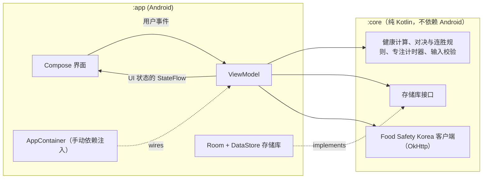

<div align="center">

🇺🇸 [English](README.md) | 🇨🇳 **简体中文** | 🇭🇰 [繁體中文](README.zh-HK.md) | 🇯🇵 [日本語](README.ja.md) | 🇰🇷 [한국어](README.ko.md)

# Beating Yesterday

**一款每日自我提升追踪应用：每一天，都是你与昨天的自己之间的一场比赛。**

[](https://github.com/jumincho/beating-yesterday/actions/workflows/ci.yml)
[](LICENSE)
-3DDC84?logo=android&logoColor=white)


</div>

## 概述

记录你吃了什么、专注了多长时间以及完成了哪些任务。首页（Home）界面会让今天和昨天进行三个回合的比赛——**饮食**（Diet）、**专注**（Focus）和**任务**（Tasks）——并告诉你是否正在战胜昨天的自己、连胜已经持续了多久，以及过去一周的战况。

| 首页 | 饮食 | 专注 |
| :---: | :---: | :---: |
|  |  |  |
| **任务** | **个人资料**（Profile） | **深色主题下的首页** |
|  |  |  |

这些截图展示的是应用真实的 Compose 界面，其中填入了示例数据。它们由 GitHub Actions 上运行的 [Robolectric 截图测试](app/src/test/kotlin/com/jumincho/beatingyesterday/ui/ScreenshotTest.kt)渲染生成，并非在手机上截取。

## 功能

- **新手引导与个人资料**：填写姓名、性别、出生年份、身高、体重和活动水平，输入会经过校验，并给出清晰的错误提示。个人资料界面会显示你的 BMI、基础代谢率、每日能量消耗以及据此得出的热量目标。
- **饮食**：按早餐、午餐、晚餐或加餐记录餐食；可以编辑记录，删除后可以撤销（Undo），还可以浏览之前的日期。进度条会将当天的总摄入量与目标进行对比。
- **可选的热量查询**：搜索 Food Safety Korea 营养成分数据库（OpenAPI 服务 `I2790`），并用某条搜索结果填写餐食。没有 API 密钥时，应用会给出相应提示，手动输入仍可正常使用。
- **专注计时器**：倒计时（25 分钟、50 分钟，或最长 3 小时的自定义时长）或秒表，支持暂停（Pause）、继续（Resume）和停止（Stop），并以进度环的形式绘制在 Compose `Canvas` 上。时间根据时间戳计算，正在进行的专注时段也会被保存，因此应用重启后计时器会从中断的地方继续。时长不少于 1 分钟的专注时段会被记录；如果倒计时在应用关闭期间结束，会在下次启动应用时记录。
- **任务**：添加、完成和删除（可撤销）当天的任务。未完成的任务会顺延到第二天，直到你完成或删除它们。
- **首页记分牌**：逐回合对比今天与昨天，并给出判定结果、连胜纪录和最近 7 天的历史记录。日期会在本地时间午夜自动切换。
- **Material 3 界面**：支持 Android 12 及以上版本的动态配色、浅色和深色主题、无边框布局、英文和韩文翻译，以及面向屏幕阅读器的标签和标题。

所有数据都保存在设备上。唯一的网络请求是可选的食物查询。

## 计分方式

### 健康指标

| 指标 | 公式 |
| --- | --- |
| BMI | weight (kg) ÷ height (m)²，四舍五入保留一位小数 |
| 基础代谢率（Mifflin–St Jeor） | 10 × weight + 6.25 × height − 5 × age **+ 5**（男性）或 **− 161**（女性） |
| 每日能量消耗（TDEE） | BMR × activity factor（活动系数）：1.2 · 1.375 · 1.55 · 1.725 · 1.9（久坐 → 非常活跃） |
| 每日热量目标 | TDEE + adjustment for the BMI category（按 BMI 分类的调整值），且不低于 1,500 kcal（男性）或 1,200 kcal（女性） |

年龄按当前年份减去出生年份近似计算。BMI 分类采用韩国肥胖学会（Korean Society for the Study of Obesity）同样使用的亚太地区分界值：

| BMI (kg/m²) | 分类 | 目标调整值 |
| --- | --- | ---: |
| < 18.5 | 体重过低 | +300 kcal |
| 18.5 – < 23 | 正常 | ±0 kcal |
| 23 – < 25 | 超重 | −300 kcal |
| ≥ 25 | 肥胖 | −500 kcal |

这些调整值和热量下限是本应用自行选定的保守取值，并非临床建议。

> [!NOTE]
> 这些数值是基于一般人群的估算，旨在激励你，并非医疗建议。改变饮食之前，请咨询医疗专业人员。

参考文献：

- Mifflin MD, St Jeor ST, Hill LA, Scott BJ, Daugherty SA, Koh YO. *A new predictive equation for
  resting energy expenditure in healthy individuals.* Am J Clin Nutr. 1990;51(2):241–247.
- WHO Regional Office for the Western Pacific, IASO and IOTF. *The Asia-Pacific perspective:
  redefining obesity and its treatment.* 2000.
- Korean Society for the Study of Obesity. *Diagnosis of Obesity: 2022 Update of Clinical Practice
  Guidelines for Obesity.* J Obes Metab Syndr. 2023;32(2):121–129.

### 每日对决

| 回合 | 今天获胜的条件 | 无数据的情况 |
| --- | --- | --- |
| 饮食 | 当天的热量摄入比昨天更接近每日目标 | 任意一天没有记录餐食 |
| 专注 | 专注的整分钟数更多 | —（没有专注记为 0 分钟） |
| 任务 | 当天完成的任务更多 | —（没有任务记为 0） |

- 数值相同则该回合打平。两天都以你当前的热量目标为准进行评判。
- **判定**：如果今天赢下的回合比输掉的多，结果为**获胜**；比输掉的少，结果为**落败**；其余情况为**平局**。
- **连胜**：连续战胜前一天的天数。今天一旦处于获胜状态，就会立即计入连胜；但在午夜之前，今天不会中断连胜。
- 专注时段计入其开始的那一天；任务计入其完成的那一天。

## 架构

代码分为一个纯 Kotlin 的领域模块和一个轻量的 Android 应用模块。



- **`:core`** 包含所有能在普通 JVM 上测试的内容：领域模型、健康计算器、个人资料和餐食校验、对决与连胜引擎、专注计时器的状态机和控制器、存储库接口，以及 `I2790` API 客户端。它不依赖 AndroidX，并提供测试夹具（fake 对象和可控时钟），供应用的测试复用。
- **`:app`** 包含 Compose 界面、每个界面各一个的 ViewModel（以 `StateFlow` 暴露不可变的 UI 状态）、基于 Room 和 DataStore 的存储库实现、类型安全的 Navigation Compose 路由，以及在 `Application` 中构建的小型 `AppContainer`。
- 时间来自注入的 `java.time.Clock`，这让日期边界既可测试，又以本地时间为准。

## 技术栈

| 类别 | 选型 |
| --- | --- |
| 语言 | Kotlin 2.2（JVM 目标版本 17）、协程和 Flow |
| UI | Jetpack Compose（BOM 2026.06.01）、Material 3、使用类型安全路由的 Navigation Compose |
| 状态 | AndroidX ViewModel 和 Lifecycle、`StateFlow` |
| 存储 | Room 2.8（KSP）存储餐食、专注时段和任务；DataStore Preferences 存储个人资料和正在运行的计时器 |
| 网络 | OkHttp 5 和 kotlinx.serialization |
| 构建 | Gradle 8.14（Kotlin DSL、版本目录）、Android Gradle Plugin 8.13、compile/target SDK 36、min SDK 26 |
| 测试 | JUnit 6、kotlinx-coroutines-test、OkHttp MockWebServer；截图测试使用 Robolectric 和 Roborazzi |
| CI | GitHub Actions：每次推送时运行单元测试、Android Lint 并构建调试版 APK；另有一个手动触发的工作流用于重新录制截图 |

确切的版本号见 [`gradle/libs.versions.toml`](gradle/libs.versions.toml)。

## 项目结构

```text
beating-yesterday/
├── app/                                  Android 应用
│   ├── schemas/                          导出的 Room 架构，供将来迁移使用
│   └── src/
│       ├── main/kotlin/com/jumincho/beatingyesterday/
│       │   ├── data/                     Room 数据库、DataStore、存储库实现
│       │   ├── di/                       AppContainer（手动依赖注入）
│       │   └── ui/                       界面和 ViewModel
│       │       ├── home/  diet/  focus/  tasks/  profile/
│       │       └── components/  format/  navigation/  theme/
│       ├── main/res/                     字符串（英文、韩文）、图标、启动器图标
│       └── test/                         ViewModel、持久化映射和截图测试
├── core/                                 纯 Kotlin 领域模块
│   └── src/
│       ├── main/kotlin/com/jumincho/beatingyesterday/core/
│       │   ├── contest/                  回合、判定、连胜、最近几天的结果
│       │   ├── data/                     存储库接口
│       │   ├── food/                     Food Safety Korea I2790 客户端
│       │   ├── health/                   BMI、BMR、TDEE、热量目标
│       │   ├── meal/  profile/  validation/
│       │   ├── model/                    领域模型
│       │   ├── time/                     设备时钟和日期切换
│       │   └── timer/                    专注计时器状态机和控制器
│       ├── test/                         单元测试
│       └── testFixtures/                 与应用测试共享的 fake 对象
├── docs/
│   ├── presentation.pptx                 项目演示文稿
│   └── screenshots/                      README 截图，由 CI 录制
├── gradle/libs.versions.toml             版本目录
└── .github/workflows/                    ci.yml（每次推送）、screenshots.yml（手动）
```

## 快速开始

### 环境要求

- JDK 17 或更高版本
- Android SDK Platform 36
- 支持 Android Gradle Plugin 8.13 的较新版本 Android Studio，用于在设备或模拟器上运行应用

### 可选：食物查询 API 密钥

热量查询需要 Food Safety Korea Open API（`I2790` 服务）的个人密钥，可通过 [Food Safety Korea 数据门户](https://www.foodsafetykorea.go.kr/api/main.do)申请。将密钥写入项目根目录下的 `local.properties`（该文件已被 git 忽略）：

```properties
FOOD_API_KEY=your-key
```

或者将 `FOOD_API_KEY` 导出为环境变量。没有密钥时，应用照样可以构建和运行，搜索区域会说明查询功能已停用。密钥会被编译进 APK，因此请使用面向客户端应用的密钥。

### 构建与测试

```bash
./gradlew assembleDebug                          # app/build/outputs/apk/debug/app-debug.apk
./gradlew :core:test :app:testDebugUnitTest      # 单元测试
./gradlew :app:lintDebug                         # Android Lint
```

CI 在每次推送时运行相同的任务，并将调试版 APK 以及测试和 Lint 报告作为工作流构件上传。

单元测试中包括 [`ScreenshotTest`](app/src/test/kotlin/com/jumincho/beatingyesterday/ui/ScreenshotTest.kt)，它使用 Robolectric 渲染主要界面并检查其关键内容。修改界面后，如需重新录制 `docs/screenshots` 中的图片，可以在 Actions 标签页中运行 **Screenshots** 工作流（它会把新图片提交到其运行所在的分支），也可以在本地录制：

```bash
./gradlew :app:testDebugUnitTest --tests com.jumincho.beatingyesterday.ui.ScreenshotTest --rerun -PrecordScreenshots
```

## 许可证

[MIT](LICENSE) © 2021 jumincho
