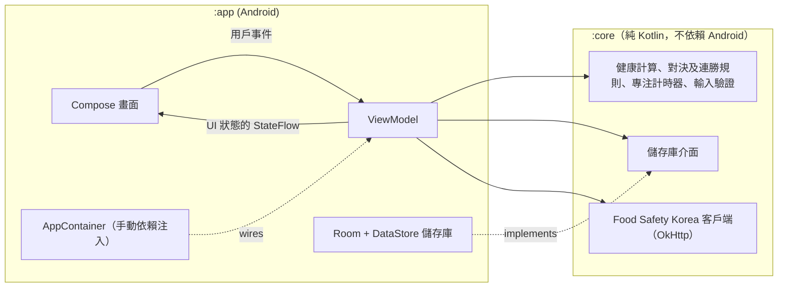

<div align="center">

🇺🇸 [English](README.md) | 🇨🇳 [简体中文](README.zh-CN.md) | 🇭🇰 **繁體中文** | 🇯🇵 [日本語](README.ja.md) | 🇰🇷 [한국어](README.ko.md)

# Beating Yesterday

**一個每日自我提升的追蹤應用程式——每一日，都是你與昨日的自己之間的一場比賽。**

[](https://github.com/jumincho/beating-yesterday/actions/workflows/ci.yml)
[](LICENSE)
-3DDC84?logo=android&logoColor=white)


</div>

## 概覽

記錄你吃了甚麼、專注了多久，以及完成了哪些任務。主頁（Home）畫面會讓今日與昨日分三個回合比賽——**飲食**（Diet）、**專注**（Focus）及**任務**（Tasks）——並告訴你是否正在勝過昨日的自己、連勝已維持多久，以及過去一星期的表現。

| 主頁 | 飲食 | 專注 |
| :---: | :---: | :---: |
|  |  |  |
| **任務** | **個人資料**（Profile） | **深色主題下的主頁** |
|  |  |  |

這些截圖展示的是填入示範數據的應用程式真實 Compose 介面，由 GitHub Actions 上的 [Robolectric 截圖測試](app/src/test/kotlin/com/jumincho/beatingyesterday/ui/ScreenshotTest.kt)渲染而成，並非在手機上擷取。

## 功能

- **首次設定及個人資料**：輸入姓名、性別、出生年份、身高、體重及活動量，所有輸入均會經過驗證，並附有清晰的錯誤訊息。個人資料畫面會顯示你的 BMI、基礎代謝率、每日能量消耗，以及由此計算出的卡路里目標。
- **飲食**：按早餐、午餐、晚餐或小食記錄每一餐；記錄可以編輯，刪除後亦可復原（Undo），並可瀏覽之前的日子。進度條會把當日的總攝取量與目標作比較。
- **可選的卡路里查詢**：搜尋 Food Safety Korea 營養成分數據庫（OpenAPI 服務 `I2790`），並以其中一項結果填寫餐點。沒有 API 金鑰時，應用程式會作出說明，手動輸入仍可照常使用。
- **專注計時器**：倒數計時（可選 25 或 50 分鐘，亦可自訂，最長 3 小時）或秒錶，可暫停（Pause）、繼續（Resume）及停止（Stop），並以進度環形式繪製在 Compose `Canvas` 上。時間按時間戳計算，進行中的專注時段亦會儲存，所以應用程式重新啟動後，計時器會由中斷的地方繼續。至少 1 分鐘的專注時段會被記錄；若倒數計時在應用程式關閉期間完結，會在下次啟動應用程式時記錄。
- **任務**：新增、完成及刪除（可復原）當日的任務。未完成的任務會順延至翌日，直至你完成或刪除為止。
- **主頁計分板**：逐個回合比較今日與昨日，並顯示判定結果、連勝紀錄及過去 7 日的紀錄。日期會在本地時間午夜自動轉換。
- **Material 3 介面**：支援 Android 12 或以上版本的動態配色、淺色及深色主題、無邊框版面、英文及韓文翻譯，以及供螢幕閱讀器讀取的標籤和標題。

所有數據都只會儲存在裝置上。唯一的網絡請求是可選的食物查詢。

## 計分方式

### 健康指標

| 數值 | 公式 |
| --- | --- |
| BMI | weight (kg) ÷ height (m)²，四捨五入至小數點後一位 |
| 基礎代謝率（Mifflin–St Jeor） | 10 × weight + 6.25 × height − 5 × age **+ 5**（男性）或 **− 161**（女性） |
| 每日能量消耗（TDEE） | BMR × activity factor（活動係數）：1.2 · 1.375 · 1.55 · 1.725 · 1.9（久坐 → 非常活躍） |
| 每日卡路里目標 | TDEE + adjustment for the BMI category（按 BMI 類別的調整值），但不會低於 1,500 kcal（男性）或 1,200 kcal（女性） |

年齡以當前年份減去出生年份估算。BMI 類別採用韓國肥胖學會（Korean Society for the Study of Obesity）亦有採用的亞太區分界值：

| BMI (kg/m²) | 類別 | 目標調整值 |
| --- | --- | ---: |
| < 18.5 | 過輕 | +300 kcal |
| 18.5 – < 23 | 正常 | ±0 kcal |
| 23 – < 25 | 過重 | −300 kcal |
| ≥ 25 | 肥胖 | −500 kcal |

這些調整值及卡路里下限是本應用程式自行訂定的保守數值，並非臨床建議。

> [!NOTE]
> 這些數字是以一般人口為基礎的估算，作激勵之用，並非醫療建議。改變飲食前，請先諮詢醫護專業人員。

參考資料：

- Mifflin MD, St Jeor ST, Hill LA, Scott BJ, Daugherty SA, Koh YO. *A new predictive equation for
  resting energy expenditure in healthy individuals.* Am J Clin Nutr. 1990;51(2):241–247.
- WHO Regional Office for the Western Pacific, IASO and IOTF. *The Asia-Pacific perspective:
  redefining obesity and its treatment.* 2000.
- Korean Society for the Study of Obesity. *Diagnosis of Obesity: 2022 Update of Clinical Practice
  Guidelines for Obesity.* J Obes Metab Syndr. 2023;32(2):121–129.

### 每日對決

| 回合 | 今日勝出的條件 | 沒有數據的情況 |
| --- | --- | --- |
| 飲食 | 當日攝取的卡路里比昨日更接近每日目標 | 其中一日沒有記錄任何餐點 |
| 專注 | 專注的完整分鐘數較多 | —（沒有專注則當作 0 分鐘） |
| 任務 | 當日完成的任務較多 | —（沒有任務則當作 0） |

- 數值相同則該回合打和。兩日均以你目前的卡路里目標作評定標準。
- **判定**：今日贏的回合比輸的多即為**勝出**，比輸的少即為**落敗**，其他情況則為**和局**。
- **連勝**：連續勝過前一日的日數。今日只要處於勝出狀態，便會即時計入連勝；但在午夜之前，今日不會令連勝中斷。
- 專注時段計入開始當日；任務計入完成當日。

## 架構

程式碼分為一個純 Kotlin 的領域模組，以及一個輕量的 Android 應用程式模組。



- **`:core`** 包含所有可以在一般 JVM 上測試的部分：領域模型、健康計算器、個人資料及餐點驗證、對決及連勝引擎、專注計時器的狀態機及控制器、儲存庫介面，以及 `I2790` API 客戶端。它不依賴 AndroidX，並提供測試夾具（fake 物件及可控制的時鐘），讓應用程式的測試重用。
- **`:app`** 包含 Compose 介面、每個畫面各一個的 ViewModel（以 `StateFlow` 公開不可變的 UI 狀態）、以 Room 及 DataStore 實作的儲存庫、類型安全的 Navigation Compose 路由，以及在 `Application` 中建立的小型 `AppContainer`。
- 時間來自注入的 `java.time.Clock`，令日子的分界既可測試，又以本地時間為準。

## 技術棧

| 範疇 | 選用技術 |
| --- | --- |
| 語言 | Kotlin 2.2（JVM 目標版本 17）、協程及 Flow |
| UI | Jetpack Compose（BOM 2026.06.01）、Material 3、採用類型安全路由的 Navigation Compose |
| 狀態 | AndroidX ViewModel 及 Lifecycle、`StateFlow` |
| 儲存 | 以 Room 2.8（KSP）儲存餐點、專注時段及任務；以 DataStore Preferences 儲存個人資料及運行中的計時器 |
| 網絡 | OkHttp 5 及 kotlinx.serialization |
| 建置 | Gradle 8.14（Kotlin DSL、版本目錄）、Android Gradle Plugin 8.13、compile/target SDK 36、min SDK 26 |
| 測試 | JUnit 6、kotlinx-coroutines-test、OkHttp MockWebServer；截圖測試使用 Robolectric 及 Roborazzi |
| CI | GitHub Actions：每次推送都會執行單元測試、Android Lint 及建置偵錯版 APK；另有一個手動執行的工作流程用來重新錄製截圖 |

準確的版本號請參閱 [`gradle/libs.versions.toml`](gradle/libs.versions.toml)。

## 項目結構

```text
beating-yesterday/
├── app/                                  Android 應用程式
│   ├── schemas/                          匯出的 Room 數據庫結構，供日後遷移之用
│   └── src/
│       ├── main/kotlin/com/jumincho/beatingyesterday/
│       │   ├── data/                     Room 數據庫、DataStore、儲存庫實作
│       │   ├── di/                       AppContainer（手動依賴注入）
│       │   └── ui/                       畫面及 ViewModel
│       │       ├── home/  diet/  focus/  tasks/  profile/
│       │       └── components/  format/  navigation/  theme/
│       ├── main/res/                     字串（英文、韓文）、圖示、啟動器圖示
│       └── test/                         ViewModel、持久化映射及截圖測試
├── core/                                 純 Kotlin 領域模組
│   └── src/
│       ├── main/kotlin/com/jumincho/beatingyesterday/core/
│       │   ├── contest/                  回合、判定、連勝、最近數日的結果
│       │   ├── data/                     儲存庫介面
│       │   ├── food/                     Food Safety Korea I2790 客戶端
│       │   ├── health/                   BMI、BMR、TDEE、卡路里目標
│       │   ├── meal/  profile/  validation/
│       │   ├── model/                    領域模型
│       │   ├── time/                     裝置時鐘及日期轉換
│       │   └── timer/                    專注計時器狀態機及控制器
│       ├── test/                         單元測試
│       └── testFixtures/                 與應用程式測試共用的 fake 物件
├── docs/
│   ├── presentation.pptx                 項目簡報
│   └── screenshots/                      README 截圖，於 CI 錄製
├── gradle/libs.versions.toml             版本目錄
└── .github/workflows/                    ci.yml（每次推送）、screenshots.yml（手動）
```

## 開始使用

### 系統要求

- JDK 17 或以上版本
- Android SDK Platform 36
- 支援 Android Gradle Plugin 8.13 的較新版本 Android Studio，用於在裝置或模擬器上執行應用程式

### 可選：食物查詢 API 金鑰

卡路里查詢需要 Food Safety Korea Open API（`I2790` 服務）的個人金鑰，金鑰經由 [Food Safety Korea 數據平台](https://www.foodsafetykorea.go.kr/api/main.do)發出。請把金鑰放入項目根目錄的 `local.properties`（該檔案已被 git 忽略）：

```properties
FOOD_API_KEY=your-key
```

或者把 `FOOD_API_KEY` 匯出為環境變數。沒有金鑰的話，應用程式依然可以建置及執行，搜尋部分會說明查詢功能已停用。金鑰會被編譯進 APK，所以請使用專供客戶端應用程式使用的金鑰。

### 建置及測試

```bash
./gradlew assembleDebug                          # app/build/outputs/apk/debug/app-debug.apk
./gradlew :core:test :app:testDebugUnitTest      # 單元測試
./gradlew :app:lintDebug                         # Android Lint
```

CI 會在每次推送時執行相同的任務，並把偵錯版 APK 以及測試和 Lint 報告作為工作流程構件上載。

單元測試包括 [`ScreenshotTest`](app/src/test/kotlin/com/jumincho/beatingyesterday/ui/ScreenshotTest.kt)，它會以 Robolectric 渲染主要畫面，並檢查其關鍵內容。更改介面後，如要重新錄製 `docs/screenshots` 內的圖片，可以在 Actions 分頁執行 **Screenshots** 工作流程（它會把新圖片提交到其執行所在的分支），或在本機錄製：

```bash
./gradlew :app:testDebugUnitTest --tests com.jumincho.beatingyesterday.ui.ScreenshotTest --rerun -PrecordScreenshots
```

## 授權條款

[MIT](LICENSE) © 2021 jumincho
